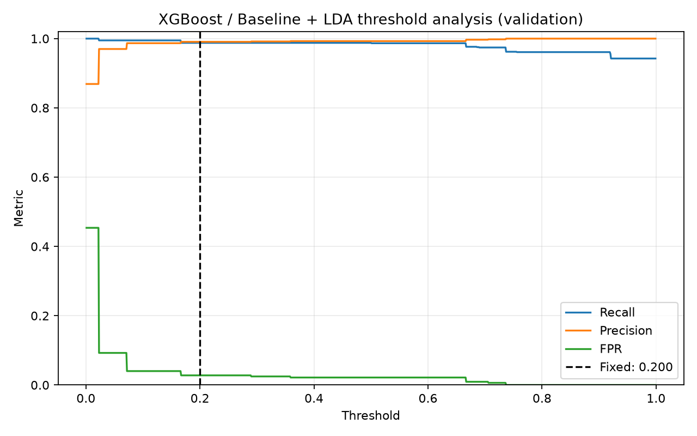
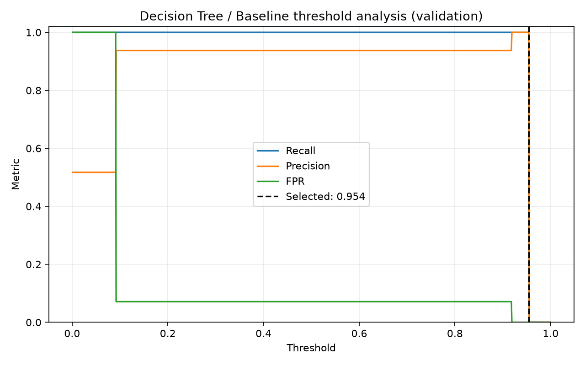
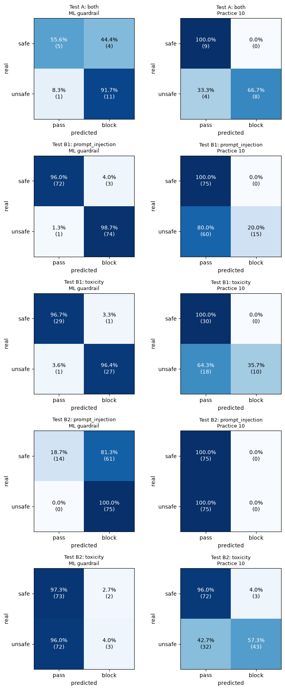
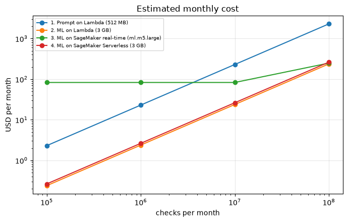

# Extra practice 10: ML guardrails against practice 10

Practice 10 detected prompt injection with **regex** and toxicity with a **prompt** (Amazon Nova Lite).
This extra practice replaces both with **machine learning classifiers** that do not call an LLM, and compares them with
practice 10 on the same texts: precision, recall, confusion matrices, time, tokens and cost.

```text
user prompt -> multilingual MiniLM embedding (384 numbers) + 9 regex flags -> (optional LDA score)
            -> calibrated Decision Tree / Random Forest / XGBoost -> probability of "unsafe" -> threshold
```

No AWS call is needed to run the ML guardrails. The comparison with practice 10 does need Bedrock (Nova Lite).

## What is in this folder

| Path | Content |
| --- | --- |
| [extra_practice_10.ipynb](extra_practice_10.ipynb) | **The main notebook**: loads the saved models, tests the `demo.py` inputs and compares with practice 10 (executed, with outputs and conclusions) |
| [ml_guardrail/experiments/prompt_injection](ml_guardrail/experiments/prompt_injection) | Experiment notebook of the prompt injection classifier (data, tuning, calibration, threshold, test results) |
| [ml_guardrail/experiments/toxicity](ml_guardrail/experiments/toxicity) | Same, for toxicity |
| [ml_guardrail/src](ml_guardrail/src) | `build_datasets.py` (builds the data from public Hugging Face datasets) and `preprocessing.py` (embedding + the 9 flags) |
| [artifacts/](artifacts) | The two winning models, saved by the last cell of each experiment notebook |
| [images/](images) | Charts used in this README |

## The two classifiers

Each experiment compares Decision Tree, Random Forest and XGBoost (3 settings each), with and without one extra LDA score, calibrates the
probabilities (sigmoid or isotonic) and chooses the threshold on the validation data. The winner is the one with the best validation PR-AUC.

| Guardrail | Data | Winner | Threshold | Precision | Recall |
| --- | --- | --- | --- | --- | --- |
| Prompt injection | 17,323 prompts (mostly a synthetic dataset), 2,599 in the test split | XGBoost + LDA | 0.2 | 0.99 | 0.99 |
| Toxicity | **382** texts, 58 in the test split (28 toxic) | Decision Tree | 0.954 | 0.96 | 0.96 |

These are the numbers on the **test split of the same data**. Read them with the size of the data in mind: the toxicity recall of 96% is 27 of 28 texts, and most
injections of the test split come from `SPML`, a synthetic dataset of template-like prompts. The next sections check what happens on other texts.

Threshold charts of the experiments (recall, precision and false positive rate by threshold, on the validation data; the dashed line is the threshold used):





## Comparison with practice 10: precision and recall

Same texts through both systems, only the injection and toxicity checks (a text is "unsafe" if it is an injection or toxic; PII, length and rate limit of practice 10 are out of scope).
Practice 10 = the regex rules + the Nova Lite prompt.

- **Test A:** 21 hand-labeled texts (the 9 `demo.py` inputs + 12 extra).
- **B1, in-domain:** the test splits of the experiments (injection: 75 safe + 75 injections sampled; toxicity: all 58 texts).
- **B2, out-of-domain:** texts that are not in the data of the experiments. Injection: 75 + 75 from `jackhhao/jailbreak-classification`. Toxicity: 75 + 75 from Jigsaw comments and `lmsys/toxic-chat`.

| Test | ML guardrail precision | ML guardrail recall | Practice 10 precision | Practice 10 recall |
| --- | --- | --- | --- | --- |
| A: 21 hand-labeled texts | 0.73 | **0.92** | **1.00** | 0.67 |
| B1 injection, in-domain (150) | 0.96 | **0.99** | 1.00 | 0.20 |
| B1 toxicity, in-domain (58) | 0.96 | **0.96** | 1.00 | 0.36 |
| B2 injection, `jackhhao`, out-of-domain (150) | 0.55 | **1.00** | 0.00 | 0.00 |
| B2 toxicity, Jigsaw and toxic-chat, out-of-domain (150) | 0.60 | 0.04 | **0.94** | **0.57** |



(Percentage confusion matrices: each row is the real class, as a percentage of that class, with the counts in parentheses.)

**The ML guardrails are good on their own data, but the result does not carry over to other texts.**
- **In-domain** they are excellent (precision and recall of 0.96 to 0.99) and far above practice 10 on recall.
- **Out-of-domain** the injection model flags almost everything (61 of the 75 harmless `jackhhao` prompts blocked, 81%), and the toxicity model finds 4% of the toxic texts, where the Nova Lite prompt finds 57%.
- **Why:** the toxicity model was trained on 267 texts and the injection model mostly on a synthetic dataset. They learned the style of those datasets and not the concepts.
- **Practice 10's regex** finds almost no injections (recall 0.20 in-domain, 0 of 75 jailbreaks), but never blocks a harmless text (precision 1.00 where it blocked anything).

### The `demo.py` inputs

The ML guardrails blocked normal AWS questions ("What is the difference between SQS and SNS?", "How do I enable versioning on an S3 bucket?", "IAM roles differ from IAM users", "ignore the typo"),
so 4 of the 21 texts were false blocks. They caught the injections (also the Portuguese one and the DAN jailbreak) and the religion insult that needs no insulting words, and missed the veiled threat ("make you regret this").
The injection model also marks the toxic texts as injections.

## Time, tokens and cost

Measured one text at a time on a local CPU, and estimated for AWS (nothing was deployed; **check the prices** before using the numbers).

| | ML guardrail | Practice 10 |
| --- | --- | --- |
| Time per check | **43 ms** (2 CPU threads; 65 to 90 ms with all cores in the test runs) | about 650 ms (regex + Nova Lite call) |
| Tokens per check | 0 | 82 input + 52 output |
| Token cost per 1M checks | $0 | $17.32 |
| Lambda compute per 1M checks | $2.37 (3 GB) | $5.64 (512 MB) |
| **Total per 1M checks (Lambda)** | **$2.37** | **$22.96** |

Estimated monthly cost by deployment (assumed us-east-1 prices, no free tiers, cold start not counted):

| Checks per month | Prompt on Lambda | ML on Lambda (3 GB) | ML on SageMaker real-time (`ml.m5.large`) | ML on SageMaker Serverless (3 GB) |
| --- | --- | --- | --- | --- |
| 100,000 | $2 | $0 | $83 | $0 |
| 1,000,000 | $23 | $2 | $83 | $3 |
| 10,000,000 | $230 | $24 | $83 | $26 |
| 100,000,000 | $2,296 | $237 | $248 | $262 |



- The ML guardrail is about 10 times cheaper and 7 to 15 times faster. On Lambda it is the cheapest up to roughly 35 million checks per month; after that an always-on endpoint wins.
- Prices used: Nova Lite $0.06 / $0.24 per 1M input / output tokens, Lambda $0.0000166667 per GB-second + $0.20 per 1M requests, SageMaker `ml.m5.large` $0.115 per hour,
  SageMaker Serverless $0.00002 per GB-second. Some of them come from third-party tables, because the official pages did not show them in a readable form.
- The ML time on Lambda is approximated with 2 CPU threads on a local machine. The Lambda container with PyTorch has a cold start of several seconds that is not counted.
- Times and Nova Lite results change a little between runs (network and machine load).

## Conclusion

- Use the ML guardrails only as a **first filter**, and treat a block as "needs a second look". A real deployment needs a larger and more varied training set, with real harmless AWS and support questions as negatives.
- The practical design is combined: ML first (fast and cheap, with a lower threshold so it misses little), and the LLM check only for the texts the ML blocks or is unsure about. That was not built or measured here.
- All of this uses small hand-made and sampled sets, one run each. These numbers are not a production benchmark.

## Run

```bash
cd extra_practice_10
source ../.venv/bin/activate
uv pip install sentence-transformers xgboost scikit-learn datasets pandas matplotlib openpyxl jupyter

python ml_guardrail/src/build_datasets.py     # builds ml_guardrail/data/*.parquet (ignored by git)
(cd ml_guardrail/experiments/prompt_injection && jupyter nbconvert --to notebook --execute --inplace notebook.ipynb)
(cd ml_guardrail/experiments/toxicity && jupyter nbconvert --to notebook --execute --inplace notebook.ipynb)

export AWS_PROFILE=avahi-sandbox-9            # credentials for Bedrock (Nova Lite), needed for practice 10 in the comparison
jupyter nbconvert --to notebook --execute --inplace extra_practice_10.ipynb
```

In VS Code, pick the kernel of the project `.venv`. The two experiment notebooks take about 15 minutes in total on a CPU (multilingual embeddings),
and the comparison notebook about 10 minutes (about 530 sequential Nova Lite calls).
