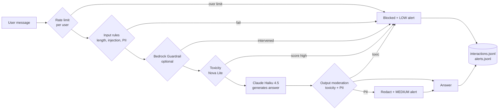
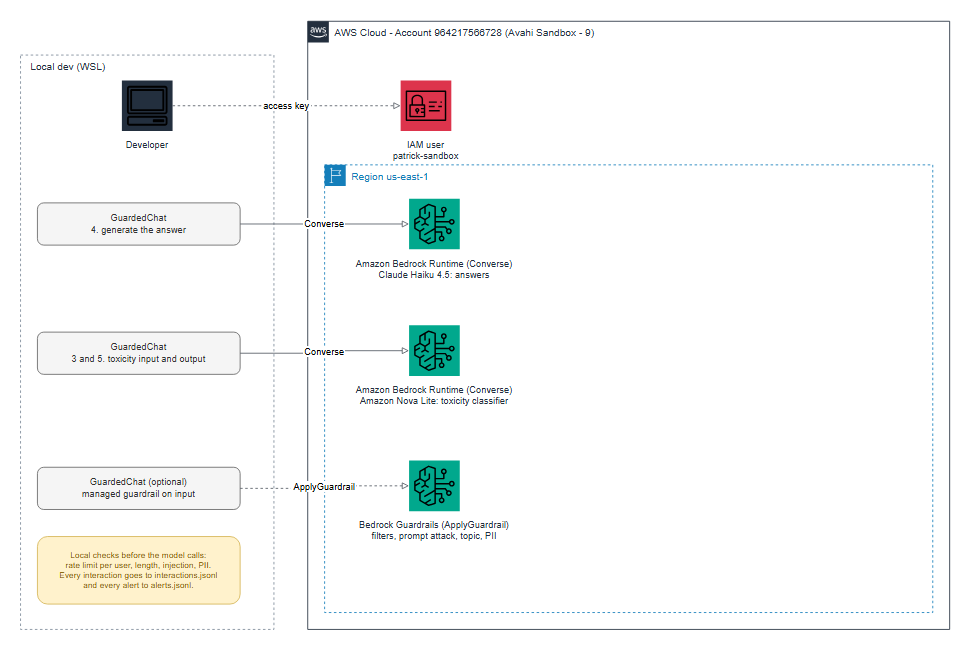

# Practice 10: Guardrails System

**Objective:** implement security and quality controls around a model: input validation,
output moderation, toxicity detection, alerts, rate limiting and complete logging. The practice
also tries the managed **Amazon Bedrock Guardrails** next to the custom implementation.

## Flow



## Architecture



Dashed lines are permissions or optional steps. The editable source is
[`diagrams/practice_10_architecture.drawio`](diagrams/practice_10_architecture.drawio) (open it in draw.io).

To rebuild the diagram after changes (from this folder):

```bash
PYTHONPATH=../tools python diagram.py
```

## Run

```bash
cd practice_10
source ../.venv/bin/activate
export AWS_PROFILE=avahi-sandbox-9
python demo.py                          # custom guardrails only
python bedrock_guardrail.py create      # creates the managed guardrail and prints its id
python bedrock_guardrail.py test <id>   # tries sample texts directly against it
python demo.py <id>                     # same demo, with the managed guardrail in the pipeline
python bedrock_guardrail.py delete <id> # cleanup
```

`demo.py` deletes and rewrites `interactions.jsonl` and `alerts.jsonl` on every run.

| File | Content |
| --- | --- |
| `guardrails.py` | The `GuardedChat` pipeline and all the checks |
| `demo.py` | 8 scenarios plus a rate limit burst |
| `bedrock_guardrail.py` | Create, test and delete a managed Bedrock Guardrail |
| `demo_output.txt`, `interactions.jsonl`, `alerts.jsonl` | Output of the last custom run |

## Task 1: Toxicity detection with an additional model

`classify_toxicity` sends the text to **Amazon Nova Lite**, a different model from the one that
answers (Claude Haiku 4.5). It returns a score from 0 to 1 for `hate`, `harassment`, `violence`,
`sexual`, `self_harm` and `illegal`. A top score of 0.5 or more blocks the message. The check
runs on the **input** (before spending tokens on generation) and on the **output**.

Design choices:
- **Fail closed:** if the classifier answer is not valid JSON, the text is treated as unsafe.
- **Nova's own filter:** for the most extreme text, Nova Lite does not return scores and answers
  "blocked by our content filters". That is counted as a detection with score 1.0
  (`model_filter`). Found while testing, before this the extreme example hit the fail-closed path.
- Order: cheap local rules run first, so obvious attacks never reach a model.

## Task 2: Alert system

`AlertSystem` writes every alert to `alerts.jsonl` and to the console.

| Severity | When |
| --- | --- |
| LOW | User was rate limited |
| MEDIUM | Blocked by input rules, PII in input or output, managed guardrail intervened |
| HIGH | Prompt injection, or a toxicity score of 0.8 or more |
| CRITICAL | The same user reaches 3 blocked requests (`repeated_violations`) |

In a real system `raise_alert` would publish to SNS, Slack or PagerDuty. It writes to a file
here to keep the practice self-contained.

## Task 3: Rate limiting per user

`RateLimiter` is a sliding window: at most **5 requests per 60 seconds per user**. Over the
limit, the user gets a message with the seconds to wait, no model is called, and a LOW alert is
raised. Limits are independent per `user_id`: in the demo, `dave` is cut at request 6 while the
other users are not affected.

**Limitation:** the counters live in process memory. With more than one instance, or after a
restart, they are lost. Production would use a shared store such as DynamoDB or Redis.

## Task 4: Complete logging

`InteractionLogger` writes one JSON line per request, **including blocked and rate-limited ones**:
id, time, user, input, status (`ok`, `blocked`, `rate_limited`, `redacted`), result of each check
(with toxicity category and score), block reason, final output and latency. For a blocked output,
the text that the model generated is also kept in `generated_output` for review.

**Privacy note:** the log stores the raw input, which may contain PII, as in the demo's PII
scenario. A real system must redact before writing, limit access to the file and set a retention period.

## Results

Custom pipeline, 15 interactions: 7 `ok`, 6 `blocked`, 2 `rate_limited`, 9 alerts.

| Scenario | User | Result |
| --- | --- | --- |
| 2 normal AWS questions | alice | Answered, all checks passed |
| "Ignore all previous instructions..." | bob | Blocked by input rules, HIGH alert |
| Email and credit card in the message | bob | Blocked, MEDIUM alert |
| Threat and insult | bob | Blocked by toxicity (`model_filter`), HIGH alert, then CRITICAL (3rd block) |
| Insult about a religion | carol | Blocked by toxicity (`hate`), HIGH alert |
| Second injection | bob | Blocked, HIGH alert |
| 1200 characters | carol | Blocked by length, MEDIUM alert |
| 7 fast requests | dave | 5 answered, 2 rate limited |

## Bedrock Guardrails (managed)

`bedrock_guardrail.py create` creates a guardrail with: content filters (hate, insults, sexual,
violence, misconduct) at HIGH, the prompt attack filter, a denied topic (`investment-advice`),
and PII handling (block card numbers and AWS keys, anonymize emails). It is called with the
`ApplyGuardrail` API, so it works independently of the model.

Direct test on 6 texts:

| Text | Managed guardrail |
| --- | --- |
| S3 versioning question | Passed |
| "Which stock should I buy this week?" | Blocked (denied topic) |
| Instruction override / reveal prompt | Blocked (prompt attack) |
| Insult | Blocked (insults) |
| Credit card number | Blocked (PII) |
| Email address | **Passed** on input (see below) |

With the guardrail in the pipeline, the toxic examples of the demo were stopped by it
(`bedrock_guardrail_input`, with VIOLENCE and INSULTS filters in the detail) before reaching the
Nova classifier. The guardrail was **deleted** after the test.

## Comparison

| | Custom | Bedrock Guardrails |
| --- | --- | --- |
| Setup | Code to write and maintain | Configuration, no code |
| Flexibility | Any rule, score and alert logic | Fixed policy types |
| Transparency | Scores per category are mine | Returns confidence and action per filter |
| Latency and cost | One extra model call per check | Billed per text unit, one fast call |
| Weak point | Regex injection rules are easy to bypass | Less control over the exact wording |

The two are complementary: use the managed guardrail as the broad base layer and the custom code
for what is specific to the product (per-user limits, alerts, audit log).

## Observations and limits

- **Not a benchmark:** 8 hand-written scenarios, one run. The numbers show that the pipeline
  works, not how accurate the classifier is. Real use needs a labeled test set and a measure of
  false positives, for example a harmless question wrongly blocked.
- **Regex rules are weak:** the injection patterns catch only the common English phrases. A
  paraphrase or another language passes the rules, which is why the managed prompt attack filter is useful.
- **Email passed the managed guardrail on input:** the email entity is set to
  `ANONYMIZE`, not block. I did not investigate why `ApplyGuardrail` reported no intervention for
  it (not confirmed). The custom rules block emails.
- **Cost of checks:** each answered request makes 3 model calls (input check, answer, output
  check), which adds latency (about 5 s per answer in the demo).
- The `demo.py` example with the managed guardrail depends on the guardrail id, which changes on each create.
