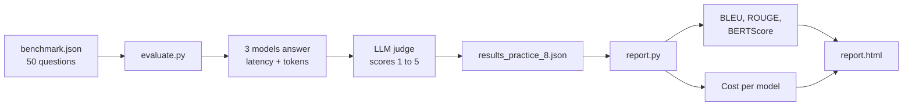
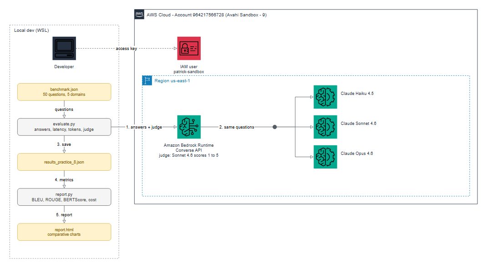

# Practice 8: Model Analysis and Evaluation

**Objective:** build an automatic evaluation system that compares models using an LLM judge, text metrics, latency and cost.

## Setup

- Models: Haiku 4.5, Sonnet 4.6, Opus 4.6 (`us.anthropic.claude-haiku-4-5-20251001-v1:0`, `us.anthropic.claude-sonnet-4-6`, `us.anthropic.claude-opus-4-6-v1`)
- Judge: Sonnet 4.6, `temperature=0`
- Packages: `sacrebleu`, `rouge-score`, `bert-score`, `torch` (CPU)

```bash
cd practice_8
source ../.venv/bin/activate
export AWS_PROFILE=avahi-sandbox-9
python evaluate.py   # answers + judge scores -> results_practice_8.json
python report.py     # metrics, costs and report.html
```

## Flow



## Architecture



Editable source: [`diagrams/practice_8_architecture.drawio`](diagrams/practice_8_architecture.drawio)
(open it in draw.io). To rebuild the image: `PYTHONPATH=../tools python diagram.py` (needs
`drawpyo` and `pillow`; rendering uses headless Microsoft Edge and needs internet access).


## Task 1: Benchmark with 50 questions

`benchmark.json` has 50 questions, 10 in each of 5 domains: geography, science, history,
AWS and tech, math and logic. Each question has a short reference answer. Models were asked
to answer in one or two sentences, so answers can be compared with the references.

## Task 2: Automatic metrics

Each answer is compared with its reference. The LLM judge scores correctness, completeness
and conciseness from 1 to 5.

What each metric means:

| Metric | Meaning |
| --- | --- |
| Correctness / Completeness / Conciseness | LLM judge score from 1 to 5: is it right, does it cover the question, is it direct |
| BLEU | Overlap of word sequences (n-grams) with the reference. 0 to 1, higher is better |
| ROUGE-1 | Share of single words that match the reference |
| ROUGE-L | Longest sequence of words in the same order as the reference |
| BERTScore | Similarity of meaning, using embeddings instead of exact words |

BLEU and ROUGE compare exact words, while BERTScore compares meaning.

| Model | Correctness | Completeness | Conciseness | BLEU | ROUGE-1 | ROUGE-L | BERTScore |
| --- | --- | --- | --- | --- | --- | --- | --- |
| Haiku 4.5 | 4.94 | 4.94 | 3.64 | 0.16 | 0.41 | 0.39 | 0.85 |
| Sonnet 4.6 | 5.00 | 5.00 | 3.78 | 0.12 | 0.43 | 0.39 | 0.84 |
| Opus 4.6 | 5.00 | 5.00 | 4.12 | 0.17 | 0.51 | 0.47 | 0.85 |

**Observation:**
- The questions were easy: only 1 answer lost correctness points (Haiku said Julius Caesar ruled the "Roman Empire", but he led the Roman Republic).
- Conciseness is what separates the models. Opus was the most direct, especially on math questions (4.9 vs 4.1 and 4.2).
- Opus scored higher on ROUGE because its answers reuse the wording of the question, like the references do. BLEU is low for all models because short answers can be correct with different words.

## Task 3: HTML report

`report.py` generates `report.html` with a summary table and 5 charts (judge scores, automatic
metrics, correctness by domain, latency, cost). It loads Chart.js from a CDN, so it needs
internet access to show the charts.

## Task 4: Costs and latency

| Model | Avg latency (s) | Avg output tokens | Cost for 50 questions (USD) | Cost per 1,000 questions (USD) |
| --- | --- | --- | --- | --- |
| Haiku 4.5 | 1.00 | 49 | 0.014 | 0.27 |
| Sonnet 4.6 | 1.73 | 47 | 0.039 | 0.79 |
| Opus 4.6 | 2.24 | 43 | 0.060 | 1.21 |

**Observation:** Haiku is about 2 times faster than Opus and about 4.5 times cheaper, with the
same quality on these questions. Opus gave the shortest answers.

## Limits of this test

- Sonnet 4.6 is both a candidate and the judge, so it may favor its own style.
- BERTScore uses `distilbert-base-uncased` (lighter than the default `roberta-large`), so values are not comparable to published scores.
- Prices are list prices assumed in `report.py` (USD per 1M tokens: Haiku 1/5, Sonnet 3/15, Opus 5/25). Check current AWS pricing. Cost includes only the answers, not the judge calls.
- Easy questions with one run each: not a hard benchmark.
