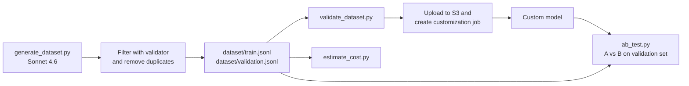
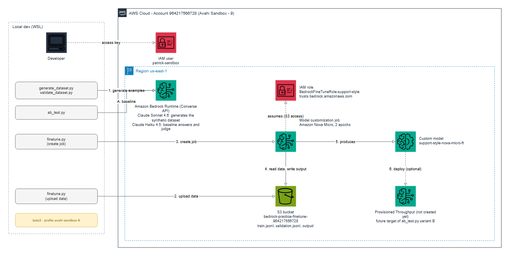

# Practice 9: Fine-tuning and Customization

**Objective:** prepare the data and the evaluation plan for fine-tuning a model, and train a custom model.

No Claude model supports fine-tuning in this account. The only text models available in
`us-east-1` are Amazon Nova, so `finetune.py` starts a job that trains **Amazon Nova Micro** for
2 epochs with this dataset.

**Result:** the job validated the data and started training, but it did not finish. It was
stopped by hand after more than 1 hour 30 minutes, so **no custom model was created** and the
A/B test below runs with a stand-in for the fine-tuned model (see "Fine-tuning job").

## Use case

An AWS support assistant with a fixed answer style: at most 2 sentences with the answer, then
one final line starting with `Next step:`. Fine-tuning fits this goal because it teaches a
consistent style and format, which prompts alone follow only part of the time.

## Fine-tuning job

| Step | What happened |
| --- | --- |
| Setup | Bucket `bedrock-practice-finetune-964217566728` and role `BedrockFineTuneRole-support-style` created by `finetune.py` (after adding S3 and IAM permissions to the user) |
| Job | `support-style-nova-micro-ft`, Amazon Nova Micro, 2 epochs, learning rate 0.00001 |
| Data validation | Completed in about 5 minutes: Bedrock accepted the dataset format |
| Training | Started about 30 minutes after the job was created, then ran for more than 1 hour without finishing |
| End | Job stopped manually. No custom model and no Provisioned Throughput were created |

**Observation:** the format validation by Bedrock confirms the dataset is correct. The training
time was far longer than expected for 108 short examples, and the API does not show progress
inside the training step. A retry would be a new job with a new name.

## Flow



## Architecture



Dashed lines are permissions or optional steps. The editable source is
[`diagrams/practice_9_architecture.drawio`](diagrams/practice_9_architecture.drawio) (open it in draw.io).

To rebuild the diagram after changes (from this folder):

```bash
PYTHONPATH=../tools python diagram.py
```

`tools/diagram_tools.py` builds the `.drawio` file and renders the PNG by opening the diagram
in the draw.io viewer with headless Microsoft Edge, so it needs internet access.

## Run

```bash
cd practice_9
source ../.venv/bin/activate
export AWS_PROFILE=avahi-sandbox-9
python generate_dataset.py   # creates dataset/train.jsonl and validation.jsonl
python validate_dataset.py   # checks the format
python estimate_cost.py      # estimates the training cost
python finetune.py start     # uploads data to S3 and starts the Nova Micro job
python finetune.py status    # shows the job status and the custom model ARN
python ab_test.py            # runs the A/B harness
```

## Task 1: Dataset with 100+ examples

`generate_dataset.py` asks Sonnet 4.6 for 20 questions and ideal answers for each of 10 AWS
topics (S3, Lambda, EC2, IAM, Bedrock, DynamoDB, VPC, CloudWatch, cost optimization, RDS).

- **Result:** 120 examples, split into 108 for training and 12 for validation (90/10).
- **Synthetic data:** written by a model and not reviewed by a human. A real project should have experts review the answers.
- **Rejected:** the generator ignored the format rules in about 30% of cases, so 80 examples
  (duplicates or invalid) were dropped automatically.
- **Format:** one JSON per line, using the Bedrock `bedrock-conversation-2024` schema:

```json
{"schemaVersion": "bedrock-conversation-2024",
 "system": [{"text": "You are a friendly AWS support assistant. ..."}],
 "messages": [
   {"role": "user", "content": [{"text": "Can S3 encrypt my files?"}]},
   {"role": "assistant", "content": [{"text": "Yes, ... Next step: ..."}]}]}
```

## Task 2: Data format validation

`validate_dataset.py` checks every example and exits with an error if something is wrong:

| Check | Why |
| --- | --- |
| Valid JSON, correct `schemaVersion` | Bedrock rejects the file otherwise |
| System prompt present | Needed by the use case |
| Roles alternate user and assistant, last is assistant | Required conversation structure |
| No empty messages, size limit | Avoid bad training examples |
| At least 32 training examples | Bedrock minimum |
| No duplicate questions | Avoid overfitting to repeated data |
| Answer has `Next step:` and 3 sentences or fewer | The style the model must learn |

The first generated file had 31 invalid examples out of 107, all missing `Next step:`. The
validator found them, and the generator now filters them. Final result: 0 invalid, 0 duplicates.

## Task 3: Estimated fine-tuning cost

`estimate_cost.py` estimates tokens as characters divided by 4. The training set has about
**17,275 tokens per epoch**.

| Epochs | Tokens trained | Training cost (USD) |
| --- | --- | --- |
| 1 | 17,275 | 0.02 |
| 2 | 34,550 | 0.03 |
| 3 | 51,825 | 0.05 |
| 5 | 86,375 | 0.09 |

**Observation:** training on this small dataset costs cents. The real cost is in **running** the
custom model: it needs Provisioned Throughput, billed per hour, plus about 1.95 USD per month
of storage. Prices are assumptions written in the script. Check the current Bedrock pricing,
and note that fine-tuning is only available for some models and regions.

## Task 4: A/B experiment design

**Question:** does the fine-tuned model follow the style better than the base model, without losing accuracy?

| Item | Design |
| --- | --- |
| Variant A (control) | Base model, no style instructions |
| Variant B | Fine-tuned model (also compare: base model + style prompt) |
| Test data | Validation questions never used in training; same prompts and settings (`temperature=0`) for both |
| Style metric | Share of answers with `Next step:` and 3 sentences or fewer |
| Quality metric | Pairwise LLM judge against the reference, with the order of A and B randomized |
| Cost metrics | Output tokens and latency per answer |
| Success criteria | Style compliance of B at least 90%, and B not preferred less often than A by the judge |
| Sample size | 12 is enough for a demo. For a real decision use 100+ questions, and repeat runs |

`ab_test.py` is a working harness. Because the training job was stopped before it finished, variant B is a **stand-in**:
the same base model (Haiku 4.5) with the style system prompt. To test a real fine-tuned model,
set its ARN as the `model_id` of variant B and remove the system prompt.

Result of the harness on the 12 validation questions:

| Variant | Style followed | Avg output tokens | Avg latency (s) |
| --- | --- | --- | --- |
| A: base model | 0 / 12 | 300 (hit the limit) | 2.96 |
| B: stand-in | 11 / 12 | 121 | 1.79 |

Judge preference on accuracy and helpfulness: A 5, B 3, tie 4.

**Observation:**
- Style control is clear: the base model never used the format, and B followed it in 11 of 12 answers, with shorter and faster answers.
- The judge slightly preferred A, probably because its long answers have more details. Shorter answers trade some detail for the required format. This is the trade-off the real A/B test must watch.
- Variant A hit the 300 token limit on every question, so its answers were cut off.

**Note:** small test (12 questions, one run) with synthetic data, not a benchmark.
