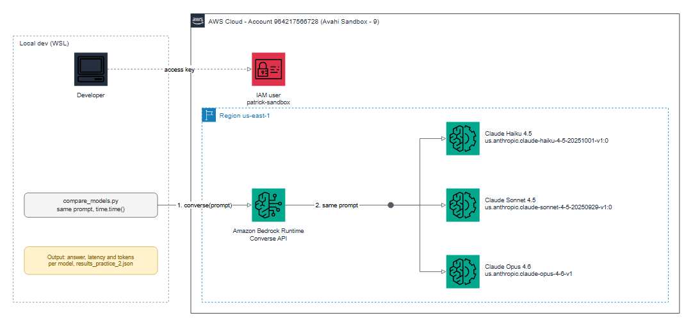

# Practice 2: Model Comparison

**Objective:** compare responses from different Amazon Bedrock models using the same prompt.

## Setup

- Script: `compare_models.py` (uses the Bedrock `converse` API, which has the same format for every model)
- Region: `us-east-1`, `maxTokens=800`
- Models:

| Name | Model ID |
| --- | --- |
| Haiku 4.5 | `us.anthropic.claude-haiku-4-5-20251001-v1:0` |
| Sonnet 4.5 | `us.anthropic.claude-sonnet-4-5-20250929-v1:0` |
| Opus 4.6 | `us.anthropic.claude-opus-4-6-v1` |

```bash
source .venv/bin/activate
export AWS_PROFILE=avahi-sandbox-9
python compare_models.py
```

Full outputs are saved in `results_practice_2.json`.

## Architecture



Editable source: [`diagrams/practice_2_architecture.drawio`](diagrams/practice_2_architecture.drawio)
(open it in draw.io). To rebuild the image: `python scripts/diagram_practice_2.py` (needs
`drawpyo` and `pillow`; rendering uses headless Microsoft Edge and needs internet access).


## Task 1: Run the code with different prompts

| Type | Prompt |
| --- | --- |
| factual | What is the difference between Amazon S3 and Amazon EBS? |
| code | Write a Python function that checks whether a string is a palindrome. |
| reasoning | A bat and a ball cost $1.10 together. The bat costs $1.00 more than the ball. How much does the ball cost? Explain briefly. |
| creative | Write a short poem about the cloud, in 4 lines. |

All three models answered every prompt without errors.

## Task 2: Differences in style and content

- **Haiku 4.5:** fast, but gives more than asked (5 versions of the palindrome function) and
  was cut off at the token limit. One doubtful claim: S3 has "lower latency".
- **Sonnet 4.5:** detailed, with concrete numbers and analogies. Also gave many versions
  of the code and hit the token limit.
- **Opus 4.6:** the most focused. One main solution with explanation and tests. The only
  model to finish the code answer within the limit.
- **Reasoning:** all three answered correctly ($0.05).
- **Creative:** all three wrote a valid 4-line poem. Quality is a matter of taste.

## Task 3: Response time (seconds)

| Prompt | Haiku 4.5 | Sonnet 4.5 | Opus 4.6 |
| --- | --- | --- | --- |
| factual | 3.84 | 9.60 | 9.79 |
| code | 3.78 | 8.43 | 11.13 |
| reasoning | 1.35 | 4.23 | 3.73 |
| creative | 1.09 | 2.55 | 2.30 |

Output tokens:

| Prompt | Haiku 4.5 | Sonnet 4.5 | Opus 4.6 |
| --- | --- | --- | --- |
| factual | 353 | 403 | 472 |
| code | 800 (cut off) | 800 (cut off) | 671 |
| reasoning | 119 | 179 | 139 |
| creative | 49 | 44 | 49 |

**Observation:** Haiku was the fastest in every test, about 2 to 3 times faster than the
others. Sonnet and Opus were similar. Each call ran once, so times are indicative only.

## Task 4: Best model for each task

| Task type | Model | Why |
| --- | --- | --- |
| Simple, high-volume, latency-sensitive tasks | Haiku 4.5 | Fastest and cheapest |
| General-purpose work (explanations, summaries) | Sonnet 4.5 | Good balance of detail and speed |
| Code and complex analysis | Opus 4.6 | Most focused and complete answers |

**Note:** small test (4 prompts, 1 run each), not a benchmark. Cost was not measured.
