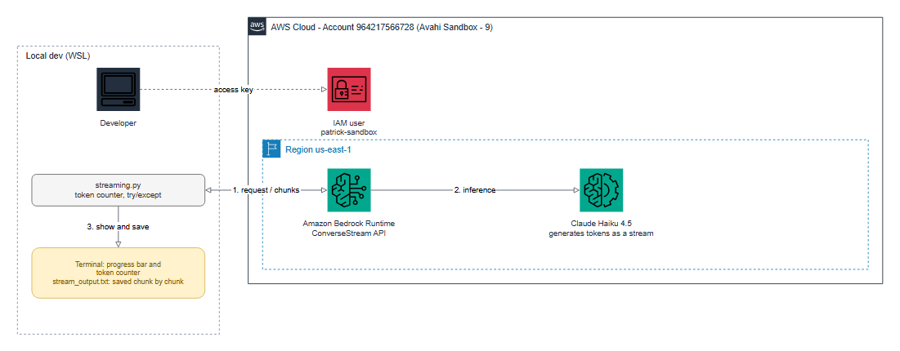

# Practice 4: Response Streaming

**Objective:** receive and display the model response incrementally instead of waiting for the full answer.

## Setup

- Script: `streaming.py` (Bedrock `converse_stream` API)
- Model: `us.anthropic.claude-haiku-4-5-20251001-v1:0`, region `us-east-1`, `maxTokens=400`
- Prompt: "Explain what Amazon Bedrock is in 3 short paragraphs."

```bash
source .venv/bin/activate
export AWS_PROFILE=avahi-sandbox-9
python streaming.py
```

The script runs three demos: progress bar, live text saved to a file, and error handling.

## Architecture



Editable source: [`diagrams/practice_4_architecture.drawio`](diagrams/practice_4_architecture.drawio)
(open it in draw.io). To rebuild the image: `python scripts/diagram_practice_4.py` (needs
`drawpyo` and `pillow`; rendering uses headless Microsoft Edge and needs internet access).


## Task 1: Real-time token counter

Each `contentBlockDelta` event carries a piece of text. The script counts the chunks and
estimates tokens as `len(text) // 4` while streaming. When the stream ends, the `metadata`
event gives the real token usage.

| Run | Chunks received | Output tokens (reported) |
| --- | --- | --- |
| Progress bar demo | 87 | 215 |
| Live text demo | 79 | 198 |

**Observation:** chunks are not tokens. One chunk can carry several tokens, so the live
counter is only an estimate. The exact value is only available at the end.

## Task 2: Error handling

The stream loop is wrapped in `try/except`:

- `ClientError`: errors returned by AWS (invalid model, access denied, throttling)
- `BotoCoreError`: connection problems
- `Exception`: any error in the middle of the stream

The file is closed in `finally`, so partial output is kept. Test with an invalid model ID:

```
AWS error: ValidationException - The provided model identifier is invalid.
Chunks received: 0 | Output tokens (reported): n/a
```

## Task 3: Save the stream to a file

Passing `save_path` writes each chunk to the file as it arrives. The result of the live
text run was saved to `stream_output.txt` (about 1 KB, 3 paragraphs).

## Task 4: Visual progress bar

The default mode prints a progress bar that updates in place, using `\r`:

```
[#####-------------------------] ~75/400 tokens (18%)
```

The bar uses the estimated tokens against `maxTokens`. Since the answer usually ends before
the limit, the bar does not reach 100%. With `live_text=True` the text is printed as it
arrives instead of the bar, because both cannot use the same line.

**Note:** small test (1 prompt, 1 run per mode). Timing was not measured.
