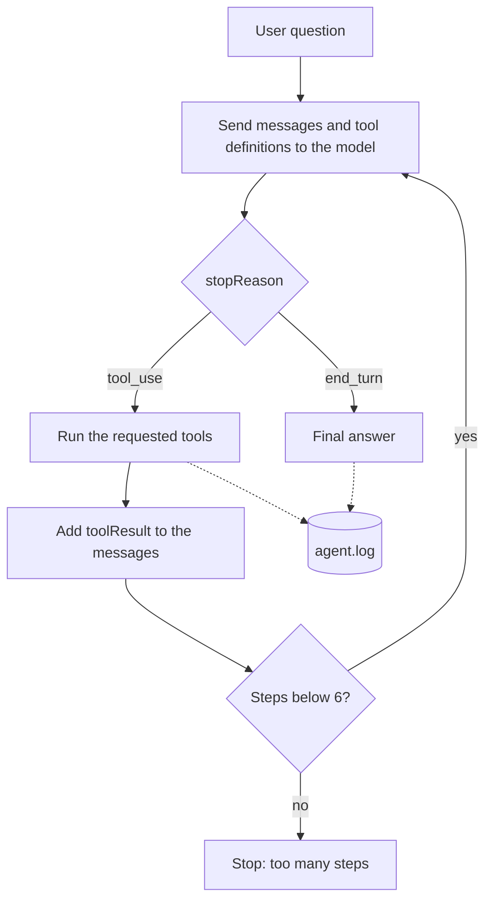
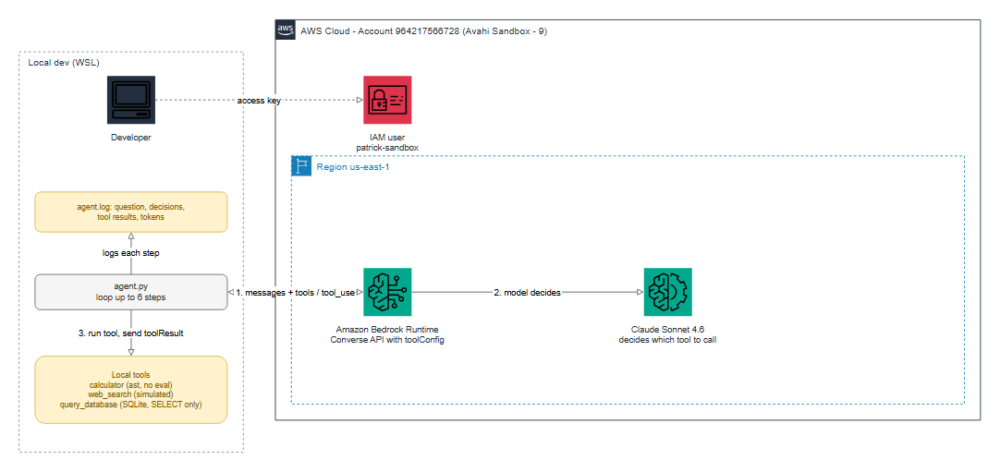

# Practice 7: Function Calling / Tool Use

**Objective:** give the model tools it can call, and build an agent that decides when to use them.

## Setup

- Script: `agent.py` (Bedrock `converse` API with `toolConfig`)
- Model: `us.anthropic.claude-sonnet-4-6`, region `us-east-1`, `temperature=0`
- Log: every run is written to the console and to `agent.log`

```bash
source .venv/bin/activate
export AWS_PROFILE=avahi-sandbox-9
python agent.py
```

## Flow



## Architecture



Editable source: [`diagrams/practice_7_architecture.drawio`](diagrams/practice_7_architecture.drawio)
(open it in draw.io). To rebuild the image: `python scripts/diagram_practice_7.py` (needs
`drawpyo` and `pillow`; rendering uses headless Microsoft Edge and needs internet access).


## Task 1: Complete tool calling cycle with multiple iterations

`run_agent()` repeats this loop, up to 6 times:

1. Send the conversation and the tool definitions to the model.
2. If `stopReason` is `tool_use`, run each requested tool.
3. Send the results back as `toolResult` messages.
4. Stop when `stopReason` is `end_turn`. That message is the final answer.

## Task 2: More tools

| Tool | What it does |
| --- | --- |
| `calculator` | Evaluates math expressions safely (parsed with `ast`, no `eval`) |
| `web_search` | Simulated: returns canned results about S3, Lambda and Bedrock (no real internet) |
| `query_database` | Runs `SELECT` queries on an in-memory SQLite table `employees(name, team, salary)`; other statements are refused |

Tool errors are caught and returned to the model with `status: error`, so the model can react.

## Task 3: Agent that decides which tools to use

The code never says which tool to use. The model chooses from the question:

| Question | Tools chosen by the model | Steps |
| --- | --- | --- |
| What is 15% of 2480? | `calculator` | 2 |
| Which team has the highest average salary, and how much higher than the other? | `query_database`, then `calculator` | 3 |
| Max timeout of Lambda in seconds, and how many employees are in Cloud? | `web_search` and `query_database` (same step), then `calculator` | 3 |

**Observation:** the model chained tools (database result into calculator) and called two
independent tools in the same step. It also converted 15 minutes to 900 seconds with the
calculator instead of guessing. All answers were correct.

## Task 4: Detailed logging of model decisions

For every step the log records the stop reason, token usage, any text the model writes
before calling a tool, the tool call with its input (`DECISION`), and the tool output
(`RESULT`). Example (question 2):

```
[step 1] stop_reason=tool_use tokens in/out=714/93
[step 1] DECISION: call query_database({"sql": "SELECT team, AVG(salary) AS avg_salary FROM employees GROUP BY team"})
[step 1] RESULT (success): [["Cloud", 10166.666666666666], ["Data", 8500.0]]
[step 2] stop_reason=tool_use tokens in/out=840/82
[step 2] DECISION: call calculator({"expression": "10166.666666666666 - 8500.0"})
[step 2] RESULT (success): 1666.666666666666
[step 3] stop_reason=end_turn tokens in/out=941/108
[step 3] FINAL ANSWER: The Cloud team has the highest average salary ...
```

**Note:** small test (3 questions). The web search is simulated and the database is sample data.
